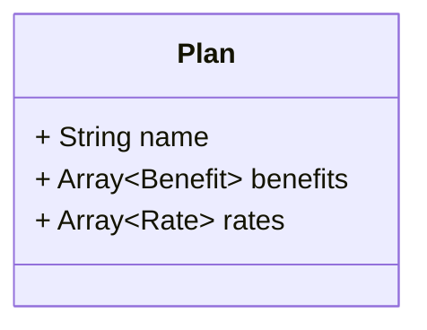
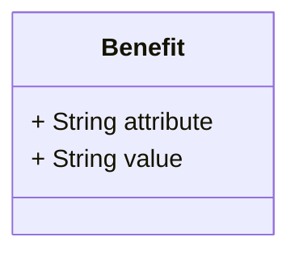
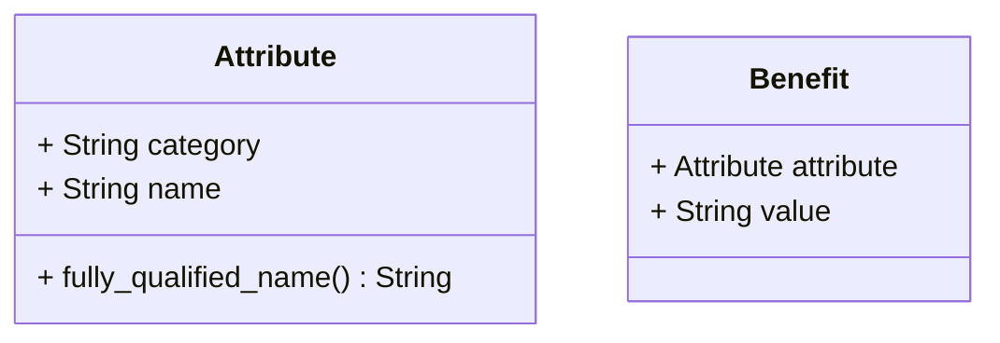
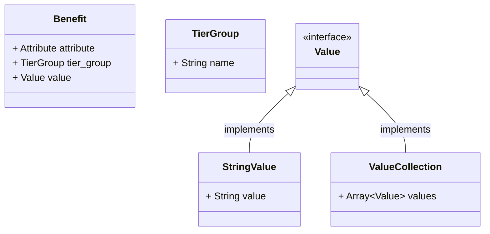
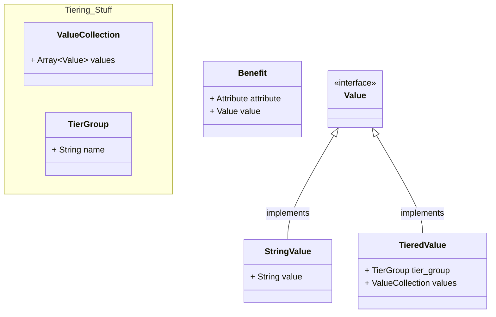
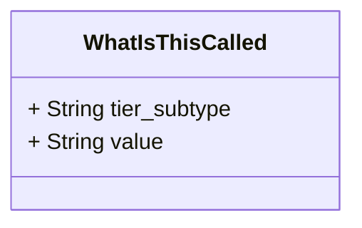
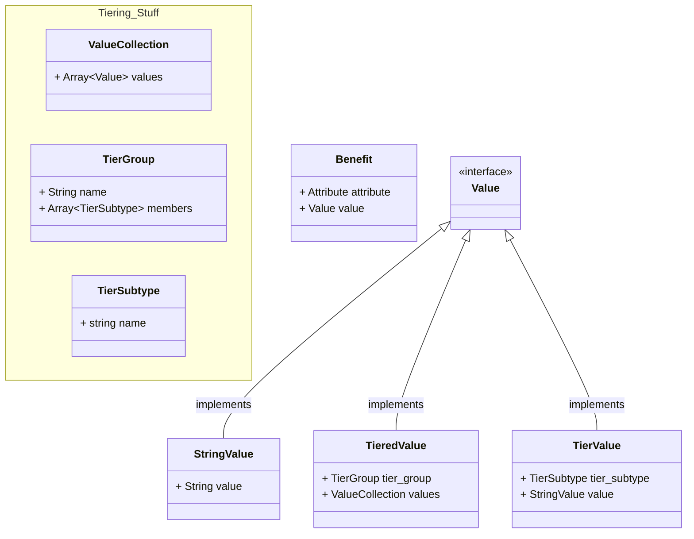
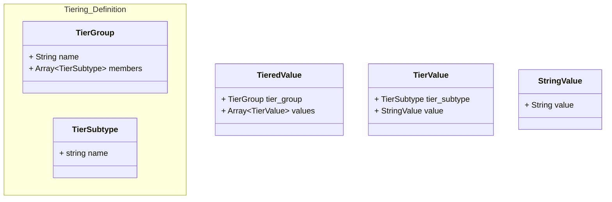
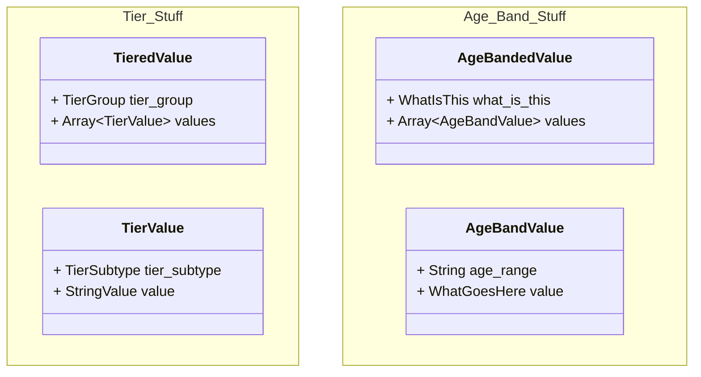

Start with a Plan.  Assume it has some semantic identifier, like a name. And it will have a collection of rates and benefits

Define a benefit. In it's simplest form -- I'll start there -- it's a key/value pair of an attribute and a value

Easy enough.  Consider that attributes are identified uniquely by a category and a name (unfortunately). We could have a class that holds those values and has a method to return a unique identifying string.  That changes our Benefit to have it's `attribute` be an `Attribute`

I think `Attribute` is a value object...it's merely an identifier; it doesn't have an identity itself

Before moving onto rates lets go down the rabbit hole of tiers.  There are two paths we could take here. In one option every benefit has an optional tier.  In another option tier isn't mentioned on the benefit but is instead captured in the value, which would be an object instead of a string

(Here my modeling gets a bit fuzzy but I think to represent a union type you have to define an interface, and then list out the things that implement the interface)

First, here's what it could look like if tier was listed on the benefit:

I don't love how the tier group is so prevalent in the interface of the benefit.  This seems to announce *potential* complexity that it might be nice to hide behind the `Value` interface.  The other thing that is strange here is that you have a dependency between the type of `tier_group` (well, it's presence or not) and the type of the `value`.

The other way gets around those things, I think.  It would look like:

I like how you can cordon-off the bits that are related to a tiered value.  I like that Benefits are just as simple as ever.  

One thing that's missing is the tier subtype though.  The benefit says the benefit name (let's say *Benefit Maximum*) and it could contain a tiered value.  That tiered value points to a tier group (let's say *Smoker/Non Smoker*). That points to a value collection that's just an array of some type of value, presumably `StringValue` since we're at the node level.  But how do we know which one is the *Smoker* value vs the *Non Smoker* value?

We need something like this

Don't pay attention to the `String` types...it's just a placeholder.  It looks *a lot* like the `Benefit` class's interface.  I've already used the name `TieredValue` which is a bummer, because that's the name that comes to mind here!

Another random thought before I try to sort anything out.  Is there a predictable pattern of nodes - each having a key/value sort of structure?  That might be helpful.  In this scenario I *think* we have that.  At the root (`Benefit`) we have a name and a value.  Drilling into the value we have a `TieredValue` node with a tier_group that's essentially a descriptor and a value field.  Drilling into the value field we should expect to have an identifier for the tier subtype and then the singular value.  That feels about right.  

Note that this doesn't hold up for the first option I explored above where there are essentially two identifiers on the root.  Though I could argue that tier group isn't a helpful identifier for any purpose other than validating that we have the types of values that we expect.  So actually, I could see this as a strong argument for having tier group be a nullable property of benefit.  It's a navel gazing issue at this point. Perhaps implementation would bring up some other considerations!

Actually I think I like option 2. it has an intermediary node that encapsulates expectations on the collection - that feels right.  So back to the `WhatIsThisCalled` object.  What is it called?!

This is mega confusing but my mind's been going to a `TieredValue` and a `TierValue`.  The adjective form (eg, `Tiered`) could be used at the collection wrapper, indicating that's what's enclosed has a scheme applied to it.  I think this would work well for age banded rates, too.  The drawback is that the names are so similar!  Let's see what it could look like:

I added a `TierGroup.members` collection that includes `TierSubtype` now that I have that defined.  I need to have `TierValue` implement `Value` so that it can live in `TieredValue.values.values`.  I'm not entirely sure that `ValueCollection` makes sense here.  It might end up being a base class or an interface or something. Realistically `TieredValue` could simply have a tier group and a collection of `TierValue`s, like so:

Let me stress-test these ideas with how rates work.  They're essentially the same except for the age-banded bit.  Let's hold off on that and think about the simple case first -- composite rates

Composite rates are similar to `StringValue` - they only hold a single value (though composite rates will hold a numeric *and* a basis, but let's consider that a value object and move on!)

So you could have a `Rate` that has an `Attribute` key and a `CompositeValue` value (I'm dropping *rate* from our existing `CompositeRateValue` name since I'm assuming it's reasonable to derive it from context).  If it's tiered you can, similar to benefits above, have a `TieredValue` as a `Rate`'s value and that `TieredValue` will have a collection of `TierValue`s, while also pointing to the `TierGroup`. That's **exactly** the same as benefits.

Now, age bands.  Let me start by assuming that the `TieredValue`/`TierValue` analogy will work here. Let's look at it side-by-side:

It *almost* works out-of-the-box. A few questions
* `TierGroup` is conceptually an object that can define the schema for the tiering.  This doesn't change with age bands, they're pretty well set.  Though, a singleton could still exist here?  There may be some benefit in having the interfaces similar!
* The `value` of an `AgeBandValue` would be what type? There was a similar issue with benefits where the leaf in a tiering situation looked a lot like a benefit.  Here, the value of a age band value looks a lot like a `CompositeRateValue`.  Maybe implementation will help us understand if that's a good or bad idea!
